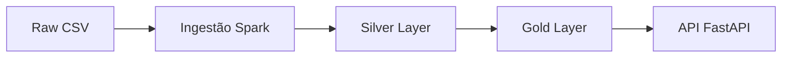

#  Governance — Rentcars Data Platform

---

#  Data Lineage

---

#  Data Contract

## Dataset: events_agg

| Campo | Tipo    |
| ----- | ------- |
| count | integer |

## SLA

* Atualização: diária
* Latência: até 2h

## Owner

* Data Engineering

## Consumers

* API
* Analytics

---

#  Schema Evolution

### raw_partner_catalog

* v1: id, name
* v2: + category
* v3: + country

## Estratégia

* Backward compatible
* Campos opcionais
* Versionamento

---

#  Backup e Recuperação

| Camada | RPO | RTO   |
| ------ | --- | ----- |
| Raw    | 24h | 2h    |
| Silver | 12h | 1h    |
| Gold   | 6h  | 30min |

## Runbook

1. Restaurar via S3 versioning
2. Reprocessar via Airflow
3. Validar dados

---

#  Segurança

* Criptografia: SSE-KMS
* IAM: least privilege
* PII: mascaramento

---

#  FinOps

## Custo por componente

* S3 → baixo
* Athena → alto risco
* EMR/Glue → médio

## Estratégias

* Lifecycle S3
* Spot instances
* Particionamento
* Compaction

## Tagging

* team=data
* env=prod/dev
* product=rentcars

## Alertas

* AWS Budgets
* Cost Anomaly Detection

---

#  Conclusão

A solução equilibra custo, performance e simplicidade, garantindo governança e escalabilidade.
