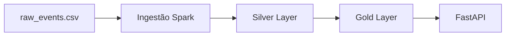

# Governance — Rentcars Data Platform

Autor: Hugo Souza

## Visão Geral

A plataforma foi construída seguindo arquitetura Lakehouse em estrutura Medalion, com ingestão via Spark, orquestração com Airflow e exposição via API FastAPI.

O objetivo é garantir:

* Governança de dados
* Segurança
* Controle de custos
* Escalabilidade

---

1. Data Lineage

---

2. Data Contract — Eventos Processados

## Tabela: `events_agg`

| Campo | Tipo    | Descrição         |
| ----- | ------- | ----------------- |
| count | integer | Número de eventos |

## SLA

* Atualização: diária
* Latência máxima: 2h

## Owner

* Data Team

## Consumers

* API FastAPI
* Times de Analytics

---

3. Schema Evolution — raw_partner_catalog

## v1

* id
* name

## v2

* id
* name
* category

## v3

* id
* name
* category
* country

4. Estratégia

* Backward compatible
* Campos novos opcionais
* Versionamento de schema

---

5. Backup e Recuperação

## Estratégia

| Dataset | RPO | RTO   |
| ------- | --- | ----- |
| Raw     | 24h | 2h    |
| Silver  | 12h | 1h    |
| Gold    | 6h  | 30min |

## Runbook

1. Restaurar dados via versionamento S3
2. Reprocessar pipeline via Airflow
3. Validar integridade dos dados

---

6. Segurança

## Criptografia

* S3 com **SSE-KMS**

## IAM

* Princípio de **least privilege**

## PII

* Mascaramento de dados sensíveis
* Controle de acesso por role

---

7. FinOps

## Lifecycle S3

* Raw → Standard
* Silver → Standard-IA
* Gold → Glacier

## Compute

* Uso de Spot Instances
* Right-sizing

## Tagging

* team=data
* product=rentcars
* env=dev/prod

## Alertas

* AWS Budgets
* Cost Anomaly Detection

---

8. Conclusão

A arquitetura proposta garante:

* Governança completa
* Eficiência de custos
* Segurança de dados
* Escalabilidade
